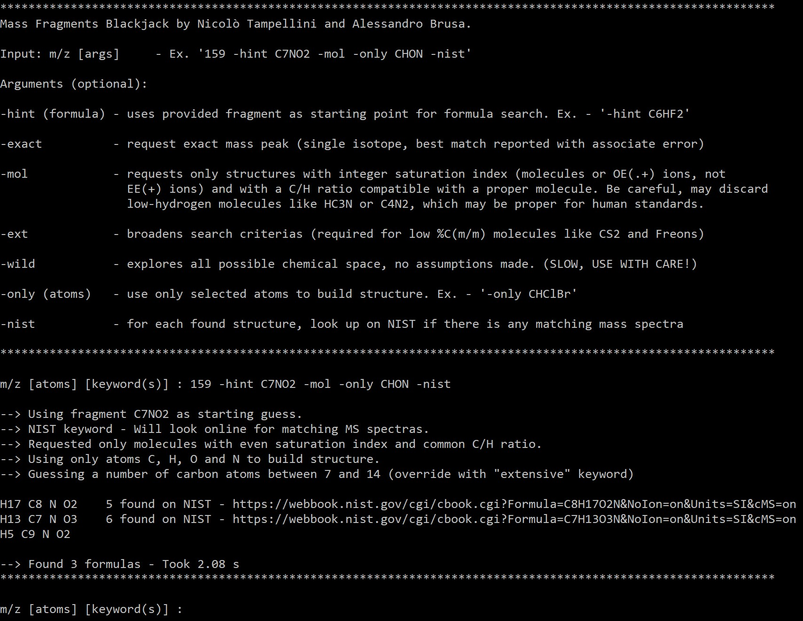

# MS_Blackjack and MS_Ion_Split

**MS_Blackjack** is a program to predict organic substances ion peak formulas in mass spectrometry from exact or nominal mass, systematically sampling heuristically defined chemical spaces. Formulas are systematically generated within a space defined by a number of carbon and hydrogen atoms plausible for an organic molecule. This assumption can be broadened to include more chemical species (_-ext_ keyword) or completely removed to sample all possible combinatorial space (_-wild_ keyword). It is possible to define which elements should make up the molecule (_-only_ keyword) and it is possible to manually input a molecular fragment as a starting guess for constructing the formula (_-hint_ keyword). The code can be interfaced with NIST mass spectral library (https://webbook.nist.gov/chemistry/form-ser/) to confront results with empirical spectra (_-nist_ keyword).

**MS_Molecular_Ion_Split** is a script to generate a histogram of the pattern of a molecular ion in mass spectrometry, given its formula. Isotopic abundances are used to estimate ratios between different isotopes of ions and the emerging pattern can help to differentiate molecules.

**Terminal interface** 

**Molecular ion pattern**

## Authors

- **Nicolò Tampellini** - [nicolo.tampellini@studio.unibo.it](mailto:nicolo.tampellini@studio.unibo.it)
- **Alessandro Brusa** - [alessandro.brusa5@studio.unibo.it](mailto:alessandro.brusa5@studio.unibo.it)

## License

**MS_Blackjack** and **MS_Molecular_Ion_Split** are available under the MIT license. See the [LICENSE](https://github.com/ntampellini/MS_Blackjack/blob/main/LICENSE.md) file for more info.
